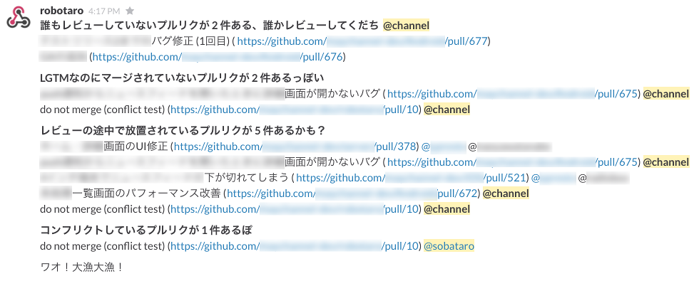

Robotaro
===

**[Japanese README](./README.md)**

Ignored Pull Request notification bot for [GitHub](https://github.com/) and [Slack](https://slack.com/)

Features
---

* Fetch your repository on GitHub periodically and check if there are "ignored" pull requests
* Notify "ignored" pull requests to your slack channel
* Using node.js and [incoming webhooks of Slack](https://maychan.slack.com/services/new/incoming-webhook)

Usage
---

    git clone
    npm install                                  # compiles src/*.coffee files into bin/*.js
    cp config/default.yaml.sample default.yaml
    edit default.yaml                            # see comments in default.yaml
    npm start                                    # start robotaro

### Debug mode

In the debug mode, messages are output to stdout (not sent to slack)

    NODE_ENV=development npm start

Which pull requests will be notified? (definition of "ignored")
---

NOTICE: robotaro's current version only has Japanese notification message; translating is future works!

1. Open PR without any comments
    * Notify "Review it" to @channel

2. Open PR has two or more comments that include "LGTM" or "looks good to me" but not merged
    * Notify "Merge it" to `PRAuthor == lastCommenter ? @channel : @PRAuthor + @lastCommenter`
    * Excepting PRs matching following condition(s):
        * The PR is labeled as "wip", "dontmerge" or "do not merge"
        * Last status (e.g. Travis CI build) is "error" or "failure"

3. Open PR with old comments
    * Notify "It seems to be halfway-reviewed and forgotten" to `PRAuthor == lastCommenter ? @channel : @PRAuthor + @lastCommenter`
    * Excepting PRs matching following condition(s):
        * The PR is labeled as "wip", "dontmerge" or "do not merge"
        * Last status (e.g. Travis CI build) is "error" or "failure"

4. Open and conflicting PR
    * Notify "conflicting" to @PRAuthor
    * Excepting PRs matching following condition(s):
        * The PR is labeled as "wip", "dontmerge" or "do not merge"

5. If there are no PR to notify
    * Notify "No PR is ignored" to @channel

Known issues and future work
---

* [Slack's Hubot integration](https://slack.com/integrations) support
* Translate notification message

Lisence
---
[MIT License](./LICENSE)
