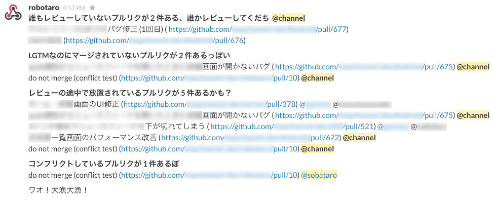

Robotaro
===

**[English README](./README.en.md)**

[GitHub](https://github.com/)と[Slack](https://slack.com/)のための、放置されたプルリクの通知ボット

機能
---

* 定期的にgithubのリポジトリを見に行って、放置されていそうなプルリクをチェック
* 放置されていそうなプルリクを見つけたらSlackに投稿
* node.jsと[Slackのincoming webhooks](https://maychan.slack.com/services/new/incoming-webhook)を利用

使い方
---

    git clone
    npm install                                  # compiles src/*.coffee files into bin/*.js
    cp config/default.yaml.sample default.yaml
    edit default.yaml                            # see comments in default.yaml
    npm start                                    # start robotaro

### Debug mode

デバッグモードではメッセージが標準出力に表示される (slackにはポストしない)

どのプルリクが通知されるのか (プルリクの「放置」の定義)
---

1. コメントのないopenなプルリク
    * @channel に "レビューしてね" と通知

2. "LGTM" または "looks good to me" を含むコメントが2件以上あるがmergeされていないopenなプルリク
    * "マージしてね" と通知
    * 通知先: `PR作者 is 最後のコメンタ ? @channel : PR作者, 最後のコメンタ`
    * ただし以下のいずれかに該当する場合は通知しない
        * ラベルに "wip", "dontmerge" または "do not merge" が含まれる
        * 最後に更新されたステータス (例: TravisCIのビルド) が "error" または "failure"

3. 最後にコメントされてからN時間以上コメントのないopenなプルリク
    * "レビュー途中で放置してない?" と通知
    * 通知先: `PR作者 is 最後のコメンタ ? @channel : PR作者, 最後のコメンタ`
    * ただし以下のいずれかに該当する場合は通知しない
        * 最後のコメントが "LGTM" または "looks good to me" を含まない
        * ラベルに "wip", "dontmerge" または "do not merge" が含まれる
        * 最後に更新されたステータス (例: TravisCIのビルド) が "error" または "failure"

4. コンフリクトしているopenなプルリク
    * PR作者に "コンフリクトしてるよ" と通知
    * ただし以下のいずれかに該当する場合は通知しない
        * ラベルに "wip", "dontmerge" または "do not merge" が含まれる

5. 通知されるべきプルリクがない場合
    * @channel に "放置されてそうなPRはないよ" と通知

既知の問題とfuture work
---

* [SlackのHubot integration](https://slack.com/integrations) のサポート
* 通知メッセージの翻訳

ライセンス
---
[MIT License](./LICENSE)
